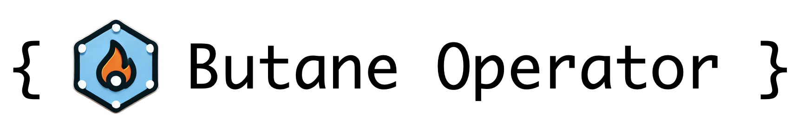

# butane-operator


## Description

The **Butane Operator** is a Kubernetes operator that automates the conversion of Butane configuration files from specific CRD into Ignition configurations into a secret. For example to give this secret to a KubeVirt CoreOS Machine. 
The operator watches for custom ButaneConfig resources and automatically translates them into Ignition JSON, storing the results in Kubernetes secrets for secure and easy access.

Butane is a tool that simplifies the creation of Ignition files, which are essential for provisioning CoreOS-based systems. 

Documenations Links : [Butane](https://coreos.github.io/butane/) | [Ignition](https://coreos.github.io/ignition/)

## Features

- **Automatic Conversion**: Watches for ButaneConfig custom resources and automatically converts them to Ignition configurations.
- **Secure Storage**: Stores the resulting Ignition JSON in Kubernetes secrets.
- **Kubernetes-Native**: Leverages Kubernetes' native capabilities for managing and storing configurations.
- **Extensible**: Can be extended to support additional features or custom workflows.

## Usage

Create a ButaneConfig Resource:  

Define your Butane configuration in a YAML file and apply it to your cluster.
```yaml
apiVersion: butane.coreos.com/v1alpha1
kind: ButaneConfig
metadata:
  name: my-butane-config
  namespace: default
spec:
  config:
    variant: fcos
    version: 1.5.0
    storage:
      files:
        - path: /etc/motd
          contents:
            inline: |
              Hello, CoreOS!
````

Apply the resource:

```sh
kubectl apply -f my-butane-config.yaml
````

Check the Generated Secret:
The operator will generate a Kubernetes secret containing the Ignition configuration.

```sh
kubectl get secret my-butane-config-ignition -o yaml
```

You can directly use secret inside KubeVirt VirtualMachine
```yaml
apiVersion: kubevirt.io/v1
kind: VirtualMachine
metadata:
  name: my-fcos
spec:
  runStrategy: Always
  template:
    spec:
      domain:
        devices:
          disks:
          - name: containerdisk
            disk:
              bus: virtio
          - name: cloudinitdisk
            disk:
              bus: virtio
          rng: {}
        resources:
          requests:
            memory: 2048M
      volumes:
      - name: containerdisk
        containerDisk:
          image: quay.io/fedora/fedora-coreos-kubevirt:stable
          imagePullPolicy: Always
      - name: cloudinitdisk
        cloudInitConfigDrive:
          secretRef:
            name: my-butane-config-ignition
```

## Getting Started

### Prerequisites
- go version v1.21.0+
- docker version 17.03+.
- kubectl version v1.11.3+.
- Access to a Kubernetes v1.11.3+ cluster.

### To Deploy on the cluster
**Build and push your image to the location specified by `IMG`:**

```sh
make docker-build docker-push IMG=<some-registry>/butane-operator:tag
```

**NOTE:** This image ought to be published in the personal registry you specified.
And it is required to have access to pull the image from the working environment.
Make sure you have the proper permission to the registry if the above commands don’t work.

**Install the CRDs into the cluster:**

```sh
make install
```

**Deploy the Manager to the cluster with the image specified by `IMG`:**

```sh
make deploy IMG=<some-registry>/butane-operator:tag
```

> **NOTE**: If you encounter RBAC errors, you may need to grant yourself cluster-admin
privileges or be logged in as admin.

**Create instances of your solution**
You can apply the samples (examples) from the config/sample:

```sh
kubectl apply -k config/samples/
```

>**NOTE**: Ensure that the samples has default values to test it out.

### To Uninstall
**Delete the instances (CRs) from the cluster:**

```sh
kubectl delete -k config/samples/
```

**Delete the APIs(CRDs) from the cluster:**

```sh
make uninstall
```

**UnDeploy the controller from the cluster:**

```sh
make undeploy
```

## Project Distribution

Following are the steps to build the installer and distribute this project to users.

1. Build the installer for the image built and published in the registry:

```sh
make build-installer IMG=<some-registry>/butane-operator:tag
```

NOTE: The makefile target mentioned above generates an 'install.yaml'
file in the dist directory. This file contains all the resources built
with Kustomize, which are necessary to install this project without
its dependencies.

2. Using the installer

Users can just run kubectl apply -f <URL for YAML BUNDLE> to install the project, i.e.:

```sh
kubectl apply -f https://raw.githubusercontent.com/<org>/butane-operator/<tag or branch>/dist/install.yaml
```

## Contributing
// TODO(user): Add detailed information on how you would like others to contribute to this project

**NOTE:** Run `make help` for more information on all potential `make` targets

More information can be found via the [Kubebuilder Documentation](https://book.kubebuilder.io/introduction.html)

## License

Copyright 2024.

Licensed under the Apache License, Version 2.0 (the "License");
you may not use this file except in compliance with the License.
You may obtain a copy of the License at

    http://www.apache.org/licenses/LICENSE-2.0

Unless required by applicable law or agreed to in writing, software
distributed under the License is distributed on an "AS IS" BASIS,
WITHOUT WARRANTIES OR CONDITIONS OF ANY KIND, either express or implied.
See the License for the specific language governing permissions and
limitations under the License.

